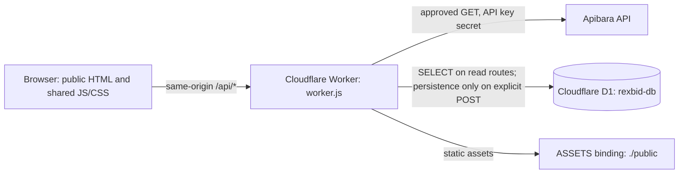
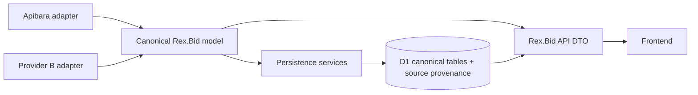

# Rex.Bid Architecture

This document describes the checked-in architecture at the `b25c452` production checkpoint, then separately describes a target for provider independence. Target components are proposals, not current code.

## Current request and data flow



The Worker is named `mtbid` for infrastructure continuity; the user-facing brand is Rex.Bid. The current production URL is `https://mtbid.tedn828.workers.dev`.

## Runtime configuration and secrets

`wrangler.jsonc` configures:

- `main: ./worker.js`
- compatibility date `2026-09-19`
- D1 binding `REXBID_DB` to database `rexbid-db`, ID `971879fe-04ed-4e8c-9dc6-5306980bb872`, migrations directory `migrations`
- static assets from `./public`, exposed as `ASSETS`

Secrets are not stored in Wrangler JSON, fixtures or source:

- `APIBARA_API_KEY` — read by the Worker only as `env.APIBARA_API_KEY` and sent upstream in `X-API-Key`.
- `REXBID_SYNC_TOKEN` — bearer token for the explicit synchronization POST. Its presence must be verified in Cloudflare before relying on that route; do not put its value in this repository.

`requestApibara(env, requestSpec)` is the only transport client. Request specs select a fixed operation; callers cannot supply arbitrary URLs. It performs GET only, sends `Accept: application/json`, uses a timeout and `redirect: "manual"`, does not retry, maps upstream HTTP errors to safe application errors, and avoids logging API credentials or upstream error bodies.

## HTTP surface

| Rex.Bid route | Method | Upstream/D1 behavior | Cache and response notes |
| --- | --- | --- | --- |
| `/api/cars` | GET | Calls Apibara `/vehicles`; no D1 writes. | Cache API key is the full request URL, so filter and cursor query strings distinguish pages. TTL 60 seconds. Returns `data` and source `meta`. |
| `/api/car/:identifier` | GET | Calls `/vehicles/:identifier`, then exact-match search `/vehicles?s=...` as needed. It can SELECT a local history summary/fallback from D1; no DML/DDL. | Live detail response is no-store. A candidate must match the requested VIN/LOT; no first-result approximation. |
| `/api/car/:identifier/history` | GET | Calls `/vehicles/:identifier/history`; D1 access is SELECT-only for vehicle/history/snapshot fallback. | No-store; `per_page` is validated/clamped to 1–20; cursor is opaque and passed through. Returns canonical `history[]`, `meta.next_cursor`, `has_more`, plus separately labelled local history/snapshots. |
| `/api/filters` | GET | Calls `/vehicles/filters`; no D1. | Cache API key includes forwarded make/series/model filters. TTL 21,600 seconds (6 hours). |
| `/api/database` | GET | D1 `SELECT COUNT(*)` for vehicles, snapshots and auction history. | No-store; diagnostic counts only. |
| `/api/sync/vehicle/:identifier` | POST | Authenticates bearer `REXBID_SYNC_TOKEN`, fetches vehicle and all bounded history pages, then persists vehicle, changed snapshots and official auction events. | No-store. Requires configured token. Rejects other methods. Synchronization does not mark success until pagination completes and persistence succeeds. |
| unknown asset path | GET | `env.ASSETS.fetch(request)` | Serves the static `public/` site. |

The API supports a broad set of `/api/cars` list filters, forwarded only from an allowlist: `s`, `platform`, `auction_type`, `lot_status`, `lot_sub_status`, `upcoming`, `make`, `series`, `model`, `generation_id`, `generation`, `type`, `body_style`, `year_from`, `year_to`, `price_min`, `price_max`, `odometer_from`, `odometer_to`, `fuel_type`, `transmission`, `drive_type`, `run_cond`, `damage`, `color`, `engine_size_from`, `engine_size_to`, `engine_type`, `cylinders`, `has_key`, `sale_document_pending`, `sale_document_type`, `seller_type`, `zip`, `radius`, `units`, `facility_id`, `loc_state`, `office_name`, `auction_date_from`, `auction_date_to`, `today_only`, `has_shipping_price`, `include_total`, `per_page`, `cursor`, and `updated_within_minutes`. Apibara remains authoritative for supported values/semantics. UI should expose only verified filters.

`/api/filters` forwards `make`, `series`, `model` to the provider adapter. Although the list endpoint has other filters, do not assume every query parameter has useful metadata or is supported identically by every upstream platform.

## Read path versus persistence

The Apibara read helpers (`fetchApibaraVehicle`, `searchApibaraVehicles`, `fetchApibaraVehicles`, `fetchApibaraHistory`) and normalization do not receive D1 and do not write data. The normal GET routes are read-only. The explicit `syncVehicle` flow is separate and owns the persistence trigger.

Persistence functions:

- `ensureDatabase(env)` prepares tables/indexes with `CREATE TABLE/INDEX IF NOT EXISTS`; it is only reached by explicit synchronization, never the GET handlers.
- `saveVehicle()` upserts the canonical vehicle row. It calculates a fingerprint and adds a `vehicle_snapshots` row for the first capture or a changed fingerprint.
- `saveOfficialHistory()` upserts event records using stable event identity where available and conservative fallback identity otherwise. Mutable status/price is not part of identity. It preserves old/raw data and does not merge different explicit event IDs.
- `syncVehicleList()` is an internal bounded list-persistence operation; the currently routed manual trigger is the vehicle-specific POST above.

No cron, queue or background scheduler is part of the current configured product trigger. Choose and authorize an operational schedule/queue separately before adding one. Do not infer that the sync token is already deployed/configured.

## D1 schema and migrations

The binding targets the dedicated Rex.Bid `rexbid-db`; the older `d1-sql` database is not the application binding and must not be migrated or repurposed by assumption.

Checked-in migrations:

1. `migrations/0000_rexbid_base.sql` creates `vehicles`, `vehicle_snapshots`, `auction_history` and baseline lookup indexes using additive `CREATE ... IF NOT EXISTS` statements.
2. `migrations/0001_auction_history_events.sql` adds nullable event fields to `auction_history`: `event_key`, `source_event_id`, `vin`, `lot`, `sale_date`, `current_bid`, `final_price`, `buy_now`, `seller`, and a non-unique `(vehicle_key,event_key)` lookup index. It deliberately does not infer final price from legacy `price` and does not add a unique index before legacy collisions are audited.

The application also contains schema preparation in `ensureDatabase()` for explicit sync compatibility. Reviewed migrations remain the deployment record of schema evolution. Never run migration SQL against production without confirming the binding/database and pending migration list. No migration is part of the current documentation checkpoint.

### Tables

- `vehicles`: current normalized searchable vehicle state, source platform/identifiers, auction and price values, condition/title/seller summary, media flags, fingerprint, timestamps and source `raw_json`.
- `vehicle_snapshots`: observation timestamps and selected auction/pricing fields whenever the vehicle first appears or its fingerprint changes. These are not auctions.
- `auction_history`: source auction event with `vehicle_key`, canonical `event_key`, optional source event ID, VIN/platform/LOT, auction and sale date, current bid, confirmed final price, Buy Now, source `price`, seller, source status, event hash, capture time and preserved raw JSON.

## Canonical data semantics

### Vehicle

`normalizeVehicle()` converts Apibara's current provider payload into the Worker’s vehicle representation. Stable concepts include `vehicleKey` (platform + VIN/LOT identity), VIN, slug VIN, platform, LOT, title/year/make/model, auction state/dates, pricing, location, condition/damage, odometer, seller and type, sale-document fields/flags, media capabilities, source URL, fingerprint and raw source object. The API currently returns the raw Apibara vehicle detail/list records rather than exposing a complete provider-neutral DTO for every route; the current frontend therefore still understands the Apibara response shape in places.

### Auction history event

Canonical history fields returned to the UI include:

```text
event_key, source_event_id, vin, platform, lot,
auction_date, sale_date, current_bid, final_price, buy_now,
source_price, seller, seller_type, status, raw_json
```

Important rules:

- Explicit `source_event_id` or `event_key` is authoritative; distinct explicit IDs remain distinct events.
- If no stable source ID is present, the fallback is based on platform + LOT (VIN if LOT is unavailable) + event date. Price/status are mutable and excluded.
- Date-only `YYYY-MM-DD` values remain date-only; do not convert them through a timezone-sensitive instant.
- Generic `price` stays `source_price`. For observed Apibara history with explicit source status `Sold`, event-level `price` may be used as confirmed sale amount; it is not used for `Not Sold`, `Sold on Approval`, pending or unknown outcomes.
- `vehicle_snapshots` are never rendered as historical auctions.
- Seller is event-specific in history. The current detail seller is not copied to an event without source evidence.

### Auction status / pricing display

The UI derives a compact Polish label from source fields. Distinguish sold, not sold and approval-pending. A source amount alone does not prove sale. For active vehicles use current bid where present; Buy Now stays separately labelled; sale price is only confirmed when event/status semantics support it. Timed listings use `is_timed` and `timed_end_at`; ordinary auction time is not a substitute.

## Static frontend and local state

`public/index.html` is the Home and full catalog. Home has four discovery aisles capped at four cards; full catalog is entered with `?catalog=1`, preserving filters and cursor pagination. `public/car.html` consumes detail and history routes. `public/ulubione.html` renders favorites from shared local storage. The other static pages cover account shell and product/company/help/contact information.

`public/rexbid-storage.js` stores curated favorite snapshots under a versioned Rex.Bid key and can migrate the legacy `mtbid_favorites` key. VIN is the primary identity; platform + LOT is a fallback. It escapes untrusted stored values and constrains image URLs. This storage is device-local, not a customer database or cross-device sync.

## Provider Independence

### Current state

Provider-neutrality is **not implemented**. `requestApibara`, Apibara route construction, `normalizeVehicle`, history field extraction, and some frontend rendering are in the same Worker/frontend codebase and use Apibara names/shape. D1 stores a useful canonical subset but also keeps raw provider JSON. Do not tell a new contributor that Provider B can be plugged in today without changes.

### Target architecture (design only; do not start a broad refactor as part of a docs task)



Recommended boundaries:

1. **Provider adapter interface:** capability discovery; paginated list; exact vehicle lookup by VIN/LOT; history page retrieval; filter metadata; adapter-specific rate limits/errors; source timestamps and source provenance. Every adapter must return typed raw envelopes internally and never access D1.
2. **Adapter normalization:** map each provider's vehicle, price, auction state, timed state, seller, title, condition, date and history fields into a versioned canonical Rex.Bid model. Preserve original source values and a provenance path per normalized value. Unknown must remain unknown; do not coerce missing provider fields into facts.
3. **Canonical model:** provider-neutral vehicle ID plus source listing IDs; separate `current_bid`, `buy_now`, `final_price`, `source_price`; event identity/provenance; source status plus canonical status; auction and timed end timestamps; date-only event dates; seller type/name; document flags; run state/keys/airbags; raw source JSON with provider and schema version.
4. **Persistence service:** receives only canonical entities/events and provenance, owns D1 reads/writes, deduplication, fingerprints and transactional/completion state. It should be callable from explicit/manual, scheduled or queue triggers without changing adapters.
5. **API DTO layer:** stable public response schemas, independent of provider payloads. Keep compatibility fields/version routes during migration; frontend should not need to know which provider populated a field.
6. **Provider routing/merging:** define deterministic source-of-truth and conflict rules for VIN identity, active listings, multiple platform LOTs, event history, stale records and provider outages. Never merge separate platform auction events solely because VIN matches.
7. **Rollout:** first add contract tests and canonical DTO alongside existing response, then adapt one route at a time behind compatibility tests. Introduce schema migrations only after a collision/data migration plan and retention/licensing review.

Adding Provider B also requires confirming data-access rights and service limits. Technical adapter compatibility does not grant rights to retain or republish provider data.
