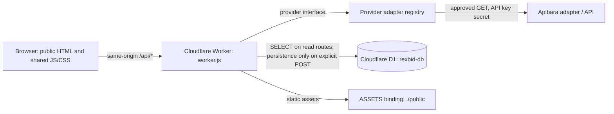
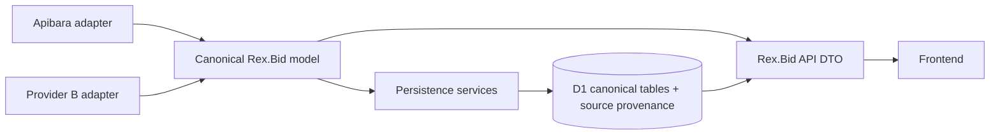

# Rex.Bid Architecture

**D1 Sync 2 status:** Phase A DONE; Phase B **D1 VERIFIED**; Phase C **SHADOW VERIFIED** on isolated staging with one bounded Apibara discovery request; Phase D NOT STARTED. `sync/d1-repository.js` is not connected to Worker/API. Proposal 0004 was applied only to staging for validation and remains outside Wrangler's production migrations. Production D1, Worker and public API are unchanged; do not apply 0004 to production without separate approval.

Status as of 2026-09-29: **PRODUCTION** is the owner-confirmed provider-independent Worker release `241cfe3e-663d-49c3-bd2b-b29e8f20cb80`; no production resources were changed during the current quality sprint. **STAGING** is Worker `rexbid-auth-test`, isolated D1 `rexbid-auth-test-db`; current infrastructure Version ID is `fc0820be-4bd4-464f-a08d-03ce81180030`. Accounts Phase 3 has owner-confirmed real-browser PASS on staging; production Auth is NOT DEPLOYED and accounts migration `0003` is NOT APPLIED to production. Request-budget improvements were deployed to staging only. The door-to-door estimator is a PROTOTYPE, not a confirmed quote. Treat local, staging, and production states separately.

## Current request and data flow


```mermaid
flowchart LR
  B[Browser: public HTML and shared JS/CSS] -->|same-origin /api/*| W[Cloudflare Worker: worker.js]
  W -->|provider interface| P[Provider adapter registry]
  P -->|approved GET, API key secret| A[Apibara adapter / API]
  W -->|SELECT on read routes; persistence only on explicit POST| D[(Cloudflare D1: rexbid-db)]
  W -->|static assets| AS[ASSETS binding: ./public]
```

The Worker is named `mtbid` for infrastructure continuity; the user-facing brand is Rex.Bid. The current production URL is `https://mtbid.tedn828.workers.dev`.

## Runtime configuration and secrets

`wrangler.jsonc` configures:

- `main: ./worker.js`
- compatibility date `2026-09-19`
- D1 binding `REXBID_DB` to database `rexbid-db`, ID `971879fe-04ed-4e8c-9dc6-5306980bb872`, migrations directory `migrations`
- static assets from `./public`, exposed as `ASSETS`

Secrets are not stored in Wrangler JSON, fixtures or source:

- `APIBARA_API_KEY` — read by the Worker only as `env.APIBARA_API_KEY` and sent upstream in `X-API-Key`.
- `REXBID_SYNC_TOKEN` — bearer token for the explicit synchronization POST. Its presence must be verified in Cloudflare before relying on that route; do not put its value in this repository.

The production provider adapter places transport and source mapping in `providers/apibara.js`. Its request specs select fixed operations; callers cannot supply arbitrary URLs. It performs GET only, sends `Accept: application/json`, reads only `env.APIBARA_API_KEY` for `X-API-Key`, uses a timeout and `redirect: "manual"`, does not retry, maps upstream HTTP errors to generic safe `ProviderError`s, and avoids logging credentials or upstream error bodies. `providers/contract.js` owns the canonical model factories, validation and provider registry. The Worker receives adapter results and performs Rex.Bid orchestration/persistence; it has no provider field-path mapping or auth-header construction.

## HTTP surface

| Rex.Bid route | Method | Upstream/D1 behavior | Cache and response notes |
| --- | --- | --- | --- |
| `/api/cars` | GET | Calls provider adapter list operation; no D1 writes. | Cache API key is the full request URL, so filter and cursor query strings distinguish pages. TTL 60 seconds. Rex.Bid returns its existing `data` and `meta` public contract through adapter compatibility serialization. |
| `/api/car/:identifier` | GET | Calls provider adapter exact lookup, then exact-match search as needed. It can SELECT a local history summary/fallback from D1; no DML/DDL. | Client response is `no-store`; successful exact records use a 30-second Worker edge cache keyed by path. A candidate must match requested VIN/LOT; no first-result approximation. Existing frontend data shape is preserved by adapter compatibility serialization. |
| `/api/car/:identifier/history` | GET | Calls provider adapter history operation; D1 access is SELECT-only for vehicle/history/snapshot fallback. | Client response is `no-store`; successful provider pages have a 5-minute edge cache keyed by full URL, including opaque cursor. Adapter validates/clamps `per_page` to the provider cap (currently 1–20); returns canonical `history[]`, `meta.next_cursor`, `has_more`, plus separately labelled local history/snapshots. |
| `/api/filters` | GET | Calls provider adapter filter metadata operation; no D1. | Cache API key includes forwarded filter narrowing parameters. TTL 21,600 seconds (6 hours). Public envelope remains `{ok,data,meta}`. |
| `/api/database` | GET | D1 `SELECT COUNT(*)` for vehicles, snapshots and auction history. | No-store; diagnostic counts only. |
| `/api/sync/vehicle/:identifier` | POST | Authenticates bearer `REXBID_SYNC_TOKEN`, fetches vehicle and all bounded history pages, then persists vehicle, changed snapshots and official auction events. | No-store. Requires configured token. Rejects other methods. Synchronization does not mark success until pagination completes and persistence succeeds. |
| unknown asset path | GET | `env.ASSETS.fetch(request)` | Serves the static `public/` site. |

### Apibara request budget and cache behavior

The current API has no provider-supported “union of Home aisles” operation. Home therefore keeps four distinct category queries, but `IntersectionObserver` issues them only as each aisle approaches the viewport; each asks for four records and the Worker caches the exact query for 60 seconds. A full Home scroll can result in up to four upstream list calls, while an initial viewport usually loads only one or two sections. Full catalog requests one page per initial search or explicit “load more” action; query and cursor remain part of the cache key.

Filter metadata is fetched on page bootstrap and when a make-specific metadata key changes; each normalized key is cached for six hours. Vehicle details use one exact detail lookup; only a definitive source 404 permits the Worker’s exact-search fallback. The browser no longer repeats the same search via `/api/cars` after the Worker has already searched. Successful details are cached at the edge for 30 seconds. History is now one page on detail-page entry; the user explicitly requests each older page, and successful pages are cached by complete URL/cursor for five minutes. Both detail/history still return client `Cache-Control: no-store` while the Worker maintains its internal cache.

Auction refresh is deployed to staging only: a single in-flight request at a time, suppressed when the page is hidden, 30 seconds while live or within five minutes of start, two minutes within one hour, ten minutes for farther scheduled auctions, and no automatic provider refresh when start time is unknown or the auction is terminal. Account/session/favorite operations call Supabase and/or D1 and issue zero Apibara calls. On provider 429/5xx/timeout the adapter performs no automatic retry. All test-suite provider cases use mocks/fixtures, not live Apibara.

## Accounts BFF proof-of-fit (staging E2E passed; not production)

The Accounts proof mounts same-origin Worker routes under `/api/auth/*` and `/api/me*`. It is deliberately fail-closed: explicit `AUTH_ENABLED=true`, exact canonical/allowed HTTPS origins, Supabase URL/publishable key, strong `REXBID_AUTH_COOKIE_SECRET`, D1 tables and a production rate-limiter binding are all required. `/api/auth/config` exposes only the enabled boolean. Owner-run real staging E2E passed on the isolated Frankfurt Supabase test project, `rexbid-auth-test`, and `rexbid-auth-test-db`; the latest reset/export/config hardening is deployed to staging version `916a2a0c-f5ad-4643-b886-927c8b2849c9`, with read-only smoke and browser rendering verified. Real recovery email/callback/password update/export download remain unverified. This does not mean auth is deployed to production.

`auth/supabase.js` owns fixed Supabase Auth REST endpoints, email/password signup/login, Google PKCE authorization and code exchange, refresh, local logout, JWKS/JWT verification, and mapping the verified Auth user to `RexIdentity`. It accepts no caller-supplied upstream URL. `SUPABASE_PUBLISHABLE_KEY` is a public project identifier, not a service-role secret; no service-role key is used. `auth/identity.js` defines `{issuer, subject, email_verified, auth_provider}` and a provider registry. Account identity is `(issuer, subject)`, never email.

`auth/session.js` seals the access/refresh pair using AES-GCM under the Worker-only cookie secret. The browser receives `__Host-rexbid_session` with `Secure; HttpOnly; SameSite=Lax; Path=/` and no `Domain`; PKCE state/verifier use a separate short-lived encrypted HttpOnly cookie. Tokens are not returned in JSON, written to localStorage, or logged by this adapter. OAuth necessarily returns a short-lived one-use authorization `code` in the callback query under Supabase PKCE; it is exchanged server-side and the response immediately redirects to a clean same-origin path. The application does not log callback URLs or query values.

Protected requests decrypt the cookie, refresh near-expiry sessions, validate JWT issuer/audience/expiry and signature using Supabase JWKS for asymmetric keys, and check Supabase `/user` for current identity/email-confirmation state. For legacy HS256 tokens (no public JWKS key), the adapter relies on Supabase `/user` to validate the signature online and does not store the JWT signing secret in Cloudflare. Auth responses are `private, no-store`; account writes require an exact same-origin `Origin`. Logout requests current-session revocation and always clears local cookies. Refresh token rotation introduces a production risk: concurrent requests at expiry can race to return `Set-Cookie`; Supabase's reuse window mitigates but does not remove stale-cookie races. Cloudflare rate limiting is required before public rollout.

| Route | Method | Semantics |
| --- | --- | --- |
| `/api/auth/google` | GET | Starts Google OAuth with PKCE and encrypted flow cookie. |
| `/api/auth/callback` | GET | Exchanges one-use code, verifies identity, maps/creates Rex.Bid user, sets cookie, then redirects without query credentials. |
| `/api/auth/signup` | POST | Creates email/password user via Supabase; verified email is required before Rex.Bid account/session provisioning. |
| `/api/auth/login` | POST | Authenticates through Supabase and sets only encrypted HttpOnly cookie. |
| `/api/auth/refresh` | POST | Refreshes a near-expiry session and rotates the cookie; never returns token material. |
| `/api/auth/logout` | POST | Requests local Supabase logout and clears browser cookies. |
| `/api/me` | GET | Returns internal account selected from verified issuer + subject. |
| `/api/me/favorites` | GET/POST | Lists or adds curated VIN/LOT/platform identity only. |
| `/api/me/favorites/:key` | DELETE | Deletes only the current verified user's favorite. |
| `/api/me/favorites/merge` | POST | Idempotently imports bounded guest identities; it does not accept vehicle payloads. |

The handler derives user ID only from D1's `(auth_issuer, auth_subject)` mapping. It scopes all favorite operations to that internal ID, rejects top-level client `user_id`, deduplicates by VIN first and `platform + LOT` otherwise, and stores no password, email, session, token, or vehicle/media payload. `GET /api/me` and favorites GET are SELECT-only; auth completion and favorite writes are explicit mutations.

`docs/proposals/0003_accounts_foundation.sql` is proposal-only and contains exactly `users` and `user_favorites` plus constraints/indexes. Its in-memory SQLite test applies it after `0000` and `0001` and verifies old vehicle/snapshot/history rows survive. Do not move it to the live migrations directory or apply it until project, region, domain, privacy/retention, and D1 target are approved.

Automated security tests use mocked Auth REST responses and a locally generated signing key/JWKS. The separate live staging E2E confirmed verified existing-user email/password login, verified issuer/subject mapping to a Rex.Bid user, HttpOnly session cookie, favorite create/list/idempotency/delete/guest merge, refresh, logout and rejection of favorite reads after logout. Owner confirmed the UI state and favorite counts. Staging D1 last observed `users=1`, `user_favorites=1` (fake test LOT retained after merge); the verification query was SELECT-only and reported `rows_written=0`.

Staging-only configuration is isolated in `wrangler.staging.jsonc`: Worker `rexbid-auth-test`, D1 `rexbid-auth-test-db`, and test page `/auth-test.html`. The test page is not in `public/` or normal navigation. Raw connectivity/fetch-option diagnostic endpoints were removed; safe request-correlation and auth-stage logs remain gated by staging-only vars. Phase 3 UI includes `public/rexbid-auth.js` on normal registration/login/account/favorites surfaces and Home/Car favorite controls. It discovers availability from same-origin `/api/auth/config`, not a hardcoded staging hostname; the server returns enabled only for an explicitly configured canonical origin. Cloud favorites are source of truth when authenticated; curated cache is namespaced by internal Rex user ID and cleared on logout, 401, or account switch. Guest favorites remain in the existing versioned local store until user consent and identifier-only merge success. Earlier login/account/session/favorites are owner-confirmed REAL BROWSER VERIFIED on staging, but the latest recovery/export/config/refresh-hardening changes are **NOT YET STAGING DEPLOYED**. Production `wrangler.jsonc` does not point at staging Worker or D1 and lacks `AUTH_ENABLED`/production limiter config; production auth is **NOT DEPLOYED**, and `0003` is **NOT APPLIED** to production D1. Do not promote staging config, secrets, test UI or test DB.

Supabase currently recommends `@supabase/server` for Workers when using stateless bearer requests; `@supabase/ssr` targets SSR frameworks and is beta. This static Rex.Bid BFF uses fixed Auth REST calls and Web Crypto rather than a browser Supabase client/localStorage.

The current adapter owns the `/api/cars` filter allowlist: `s`, `platform`, `auction_type`, `lot_status`, `lot_sub_status`, `upcoming`, `make`, `series`, `model`, `generation_id`, `generation`, `type`, `body_style`, `year_from`, `year_to`, `price_min`, `price_max`, `odometer_from`, `odometer_to`, `fuel_type`, `transmission`, `drive_type`, `run_cond`, `damage`, `color`, `engine_size_from`, `engine_size_to`, `engine_type`, `cylinders`, `has_key`, `sale_document_pending`, `sale_document_type`, `seller_type`, `zip`, `radius`, `units`, `facility_id`, `loc_state`, `office_name`, `auction_date_from`, `auction_date_to`, `today_only`, `has_shipping_price`, `include_total`, `per_page`, `cursor`, and `updated_within_minutes`. Adapter metadata narrowing currently accepts `make`, `series`, `model`, and `generation_id`. Only verified provider-supported filters should reach the UI.

`/api/filters` forwards `make`, `series`, `model` to the provider adapter. Although the list endpoint has other filters, do not assume every query parameter has useful metadata or is supported identically by every upstream platform.

## Read path versus persistence

Provider adapter fetch/normalization methods do not receive D1 and do not write data. Generic Worker read helpers call the selected adapter. The normal GET routes are read-only. The explicit `syncVehicle` flow is separate and owns the persistence trigger.

Persistence functions:

- `ensureDatabase(env)` prepares tables/indexes with `CREATE TABLE/INDEX IF NOT EXISTS`; it is only reached by explicit synchronization, never the GET handlers.
- `saveVehicle()` upserts the canonical vehicle row. It calculates a fingerprint and adds a `vehicle_snapshots` row for the first capture or a changed fingerprint.
- `saveAuctionHistory()` upserts event records using stable event identity where available and conservative fallback identity otherwise. Mutable status/price is not part of identity. It preserves old/raw data and does not merge different explicit event IDs.
- `syncVehicleList()` is an internal bounded list-persistence operation; the currently routed manual trigger is the vehicle-specific POST above.

No cron, queue or background scheduler is part of the current configured product trigger. Choose and authorize an operational schedule/queue separately before adding one. Do not infer that the sync token is already deployed/configured.

## D1 schema and migrations

The binding targets the dedicated Rex.Bid `rexbid-db`; the older `d1-sql` database is not the application binding and must not be migrated or repurposed by assumption.

Checked-in migrations:

1. `migrations/0000_rexbid_base.sql` creates `vehicles`, `vehicle_snapshots`, `auction_history` and baseline lookup indexes using additive `CREATE ... IF NOT EXISTS` statements.
2. `migrations/0001_auction_history_events.sql` adds nullable event fields to `auction_history`: `event_key`, `source_event_id`, `vin`, `lot`, `sale_date`, `current_bid`, `final_price`, `buy_now`, `seller`, and a non-unique `(vehicle_key,event_key)` lookup index. It deliberately does not infer final price from legacy `price` and does not add a unique index before legacy collisions are audited.

The application also contains schema preparation in `ensureDatabase()` for explicit sync compatibility. Reviewed migrations remain the deployment record of schema evolution. Never run migration SQL against production without confirming the binding/database and pending migration list. No migration is part of the current documentation checkpoint.

### Tables

- `vehicles`: current normalized searchable vehicle state, source platform/identifiers, auction and price values, condition/title/seller summary, media flags, fingerprint, timestamps and source `raw_json`.
- `vehicle_snapshots`: observation timestamps and selected auction/pricing fields whenever the vehicle first appears or its fingerprint changes. These are not auctions.
- `auction_history`: source auction event with `vehicle_key`, canonical `event_key`, optional source event ID, VIN/platform/LOT, auction and sale date, current bid, confirmed final price, Buy Now, source `price`, seller, source status, event hash, capture time and preserved raw JSON.

## Canonical data semantics

### Vehicle

`providers/contract.js` defines versioned canonical factories for `RexVehicle`, `RexAuction`, `RexPricing`, `RexSeller`, `RexCondition`, `RexDocument`, `RexMedia`, `RexHistoryEvent`, and `RexFilterMetadata`, plus shape validation. `providers/apibara.js` maps the current source to these concepts and also retains the existing compatibility serializer so current browser pages receive their unchanged record structure. Provider provenance and `raw_payload` remain available to persistence. The Worker’s current D1 normalized row remains a flattened application projection for compatibility; the canonical object is attached internally and is not yet the sole D1/API representation.

### Auction history event

Canonical history fields returned to the UI include:

```text
event_key, source_event_id, vin, platform, lot,
auction_date, sale_date, current_bid, final_price, buy_now,
source_price, seller, seller_type, status, raw_json
```

Important rules:

- Explicit `source_event_id` or `event_key` is authoritative; distinct explicit IDs remain distinct events.
- If no stable source ID is present, the fallback is based on platform + LOT (VIN if LOT is unavailable) + event date. Price/status are mutable and excluded.
- Date-only `YYYY-MM-DD` values remain date-only; do not convert them through a timezone-sensitive instant.
- Generic `price` stays `source_price`. For observed Apibara history with explicit source status `Sold`, event-level `price` may be used as confirmed sale amount; it is not used for `Not Sold`, `Sold on Approval`, pending or unknown outcomes.
- `vehicle_snapshots` are never rendered as historical auctions.
- Seller is event-specific in history. The current detail seller is not copied to an event without source evidence.

### Auction status / pricing display

The UI derives a compact Polish label from source fields. Distinguish sold, not sold and approval-pending. A source amount alone does not prove sale. For active vehicles use current bid where present; Buy Now stays separately labelled; sale price is only confirmed when event/status semantics support it. Timed listings use `is_timed` and `timed_end_at`; ordinary auction time is not a substitute.

## Static frontend and local state

`public/index.html` is the Home and full catalog. Home has four discovery aisles capped at four cards; full catalog is entered with `?catalog=1`, preserving filters and cursor pagination. `public/car.html` consumes detail and history routes. `public/ulubione.html` renders favorites from shared local storage. The other static pages cover account shell and product/company/help/contact information.

`public/rexbid-storage.js` stores curated favorite snapshots under a versioned Rex.Bid key and can migrate the legacy `mtbid_favorites` key. VIN is the primary identity; platform + LOT is a fallback. It escapes untrusted stored values and constrains image URLs. This storage is device-local, not a customer database or cross-device sync.

## Provider Independence

### Current state

The provider transport and source-specific field mapping are isolated in `providers/apibara.js`; the contract and registry are in `providers/contract.js`. Worker route orchestration calls provider methods for lookup, search/list, history, filters, record extraction, pagination metadata, exact matching, and public compatibility serialization. Apibara’s key, endpoint paths, response nesting, field names, transport errors and event-price interpretation are confined to the adapter. The fake Provider B is test-only. Provider Independence is deployed in production Worker version `241cfe3e-663d-49c3-bd2b-b29e8f20cb80` (GitHub checkpoint `1d917d0`).

The public Rex.Bid API is deliberately backward-compatible, not yet a fully provider-neutral canonical JSON API. The current Apibara adapter returns the established vehicle compatibility records consumed by the frontend; another adapter must serialize to that same legacy contract until a separately versioned public DTO is approved. This boundary lets the provider be replaced without changing frontend files, but it does not claim the existing public record shape is source-agnostic.

### Adapter contract and remaining design


```mermaid
flowchart LR
  A[Apibara adapter] --> N[Canonical Rex.Bid model]
  B[Provider B adapter] --> N
  N --> P[Persistence services]
  P --> D[(D1 canonical tables + source provenance)]
  N --> API[Rex.Bid API DTO]
  D --> API
  API --> F[Frontend]
```

The initial adapter/registry and canonical model exist locally. Remaining recommended boundaries and rollout requirements:

1. **Provider adapter interface:** the implemented registry checks required methods for vehicle lookup/search/list, history, filters, normalization, validation support and public compatibility serialization. Adapters never receive D1. Add capability-specific optional methods only when a provider lacks an operation.
2. **Adapter normalization:** implemented for Apibara vehicle, history and filter payloads. Preserve raw payload/provenance; missing fields remain null; event price semantics stay provider-specific. Add normalized-field provenance paths only if later conflict resolution requires them.
3. **Canonical model:** implemented factories cover separate auction/pricing, source IDs, status/source status, timed state/end, seller, condition, document flags, media, date-only event dates, and raw payload. Vehicle identity is still the current `vehicleKey` projection and is not yet a provider-source identity model.
4. **Persistence service:** existing Worker `saveVehicle`, `saveAuctionHistory` and snapshot logic remain explicit sync-side and consume normalized compatibility projections; GET remains read-only. A deeper persistence interface accepting only canonical entities can follow after identity/data-rights decisions without changing the adapter.
5. **Public DTO/compatibility:** current endpoints and frontend contract are unchanged. Adapters own compatibility serialization. A separately versioned canonical public DTO is a future migration, not part of this refactor.
6. **Provider routing/merging:** only Apibara is registered for production. Provider selection is Worker-side configuration only; the client cannot select an arbitrary provider. Source-of-truth and cross-provider merge rules remain open.
7. **D1 identity evolution:** current `vehicles.vehicle_key` and `auction_history(vehicle_key,event_key)` do not namespace records by provider. Preserve PKs/data; add source identity additively only after collision analysis (proposal below).
8. **Deployment gate:** validate build/test contract, review exact migration only when needed, and confirm provider retention/license terms before any new durable archival or cross-provider redistribution.

> **SUPERSEDED DESIGN NOTE:** The historical proposal text in this section describes `0002_provider_sync_foundation.sql`. For all future design/review, use the more complete `docs/D1_SYNC_2_DESIGN.md` and empty-table-only `docs/proposals/0004_d1_sync_2.sql` below/linked from the current architecture summary. Both are **PROPOSED / NOT DEPLOYED**. Do not apply 0002 or 0004; do not apply them together. The 0002 identity approach is not sufficient for relisting/LOT reuse and alters existing tables.

### D1 multi-provider adequacy and additive proposal (superseded; not implemented)

The current schema can retain the existing normalized vehicle/event columns and raw JSON, but it is **not sufficient as a source identity model for multiple providers**: `vehicle_key` is not `(provider, provider_vehicle_id)`; history does not have a `provider` namespace; existing event keys/indexes can collide across providers; one `raw_json` is a latest source snapshot, not a separate record per source listing. Do not change existing primary keys or re-key rows without a collision report.

If/when needed, prepare an additive migration proposal (do not run it now):

- Add `vehicle_sources` keyed by `(provider, provider_vehicle_id)` with `vehicle_key` link, platform/source listing ID, `source_updated_at`, `last_synced_at`, normalizer version and nullable raw payload only if rights permit. This avoids changing current `vehicles` PK and can associate multiple provider records with one Rex vehicle.
- Add nullable `provider` to `auction_history` and a non-unique composite lookup index such as `(provider, vehicle_key, event_key)` only after scanning existing collisions. Keep existing `event_key`, source IDs, raw JSON and all rows.
- Add `sync_state`/`sync_runs` only when resumable scheduled sync needs durable checkpoints; current manual POST can remain without a new table.
- Audit before any uniqueness constraint; never auto-delete or merge ambiguous records.

### Data Sync Foundation — historical proposal, superseded; current design is D1 Sync 2

The current production GET model is upstream-first; the local provider refactor still keeps GET as read-only. `vehicles.last_seen_at` is an observation time, not a reliable per-provider `last_synced_at`. Existing state has no per-source identity, freshness state, lease, or run record. Therefore it cannot safely answer which provider listing was refreshed, resume/coordinate a run, or distinguish stale data from a failed refresh.

An additive schema proposal is prepared at `docs/proposals/0002_provider_sync_foundation.sql`. It is intentionally outside Wrangler's configured `migrations/` directory and **must not be applied as-is without review**. It adds nullable source provenance to snapshots/history, a `vehicle_sources` table for per-provider identity/freshness/lease/error state, and a `sync_runs` table for run status/counters/continuation. It does not copy raw payloads or media URLs into the new tables, rewrite current PKs, backfill source mappings, or add unique auction-event indexes. It was syntax-checked against the existing migrations in an in-memory SQLite database with sample legacy data; the sample row and `raw_json` remained intact.

#### Identity and collision policy

- Keep `vehicles.vehicle_key` unchanged. It remains Rex.Bid's current vehicle/listing row identity; it is not a provider key.
- Use a `source_key` namespaced by provider and platform. Build it from a confirmed provider vehicle/listing ID when available; otherwise use platform + LOT; VIN is the last fallback. Record `identity_kind` so operators can tell which key was used.
- A VIN-only source record may not distinguish concurrent/relisted lots. Do not merge it automatically into an existing source with a different LOT or event. Mark ambiguous records for review rather than inventing a stable source ID.
- Scope history identity with `(provider, source_key/vehicle_key, event_key)` only after an audit. Existing `auction_history` rows stay with `provider = NULL`; do not assign a provider retroactively without evidence. Keep lookup indexes non-unique until collisions are reviewed.
- Use a non-unique source-to-vehicle link first. Any provider-source conflict policy or canonical vehicle merge is a later, separately tested decision.

#### Orchestration and failure handling

```text
trigger → claim source lease → provider fetch → canonical normalize → validate
        → persist valid vehicle + changed snapshot → fetch history page(s)
        → idempotent event upserts → complete run/update last_synced_at
```

- The adapter continues to own upstream requests and normalization only. It gets no D1 binding. A sync service owns leases, validation gates, persistence and run accounting.
- Claim a source with a conditional compare-and-swap update on `lease_expires_at`; only the invocation that changes one row owns the lease. Renew between pages and release on every exit. Expired leases permit recovery after a crashed Worker. Do not hold one global lock for a long backfill.
- Persist each fully received/validated history page idempotently and update that run's `next_cursor` and counters atomically with page persistence. Keep the cursor only while a run is incomplete and clear it at completion. If a provider cursor is rejected/expired, restart from page one; event-key upserts make replay safe. Never label a partially paginated run complete.
- `last_attempt_at` updates for every attempt. `last_synced_at` advances only after all required vehicle/history pages complete. On a partial failure, keep prior good field values, mark the run/source `partial` or `failed`, retain the last successful timestamp, and expose staleness separately; do not treat null/missing provider fields as clears.
- 429/5xx/timeout/provider-unavailable errors do not trigger hidden retries. Preserve D1 data, record a bounded error code, and defer retry through the chosen trigger/queue policy. Honor a validated Retry-After as a lower bound, subject to a configured cap. No schedule or request rate is selected here; obtain plan limits and use a centralized provider request budget before enabling concurrency.
- Per-source leases stop duplicate synchronization of one listing. A separate provider-wide rate/concurrency limiter is required before parallel work across different sources. Until quotas are verified, use sequential bounded pages and no fan-out.
- Revisit old/closed listings by source `last_synced_at` and source status policy, not just by latest inventory date: sold/approval/pending events can change after their auction. Run history should record counts and status only, not response bodies.

#### Moving GET toward D1 without hidden synchronization

1. Backfill/import source rows through explicit protected sync only, after provider rights are cleared and source identity behavior is tested.
2. Add a D1-first read path for details and saved history: return the last good row (with freshness metadata/header if needed) and never invoke persistence from GET. For a cache miss, retain a read-only upstream fallback during rollout; it must not write.
3. Move `/api/cars` to D1 only after its filters, ordering and cursor semantics can be evaluated in SQL before pagination. Current typed `vehicles` columns do not cover all supported catalog filters. A separate additive catalog projection may be needed; do not fetch 20 upstream rows then filter/page them locally and call that a complete catalog.
4. Keep API response JSON and frontend behavior stable. Use provider-owned compatibility serialization for records read from D1; do not expose source-specific rows directly.

#### Data retention gate

The proposal stores only identity, freshness, status, lease and run counters in new tables; it does not expand photo/history payload storage. Apibara factual data/history/snapshots retention permission is now recorded in `docs/APIBARA_DATA_RIGHTS.md`. Existing raw JSON policy remains subject to minimization/configuration and any applicable platform/privacy obligations. Permanent archive/redistribution of original Copart/IAA photos is not approved by the Apibara response.

Adding Provider B also requires confirming data-access rights and service limits. Technical adapter compatibility does not grant rights to retain or republish provider data.

## D1 Sync 2 — Phase A DONE / Phase B D1 VERIFIED / Phase C SHADOW VERIFIED / Phase D NOT STARTED

Aktualny, nadrzędny projekt znajduje się w `docs/D1_SYNC_2_DESIGN.md`; addytywny schemat znajduje się w `docs/proposals/0004_d1_sync_2.sql`. Proposal 0004 zastosowano wyłącznie do staging D1 `rexbid-auth-test-db` na potrzeby walidacji; nadal nie należy do aktywnych migracji Wrangler. Wcześniejszy opis powyżej oraz `0002_provider_sync_foundation.sql` są historyczne i zostały koncepcyjnie zastąpione przez 0004. **Nie stosować 0002 ani 0004 do produkcji bez osobnej zgody.**

Schemat propozycji oddziela encję auta, źródło providera, lifecycle listingu i event history. `vehicle_key` oraz PK legacy pozostają bez zmian; nie planujemy masowego backfillu. VIN jest wskazówką dopasowania, a LOT nie jest globalnie trwały. Niejednoznaczne rekordy/relisting pozostają osobne.

`sync/d1-repository.js` to provider-neutral repository. Przyjmuje canonical records, nie importuje Apibara i nie zapisuje raw payload/media/events/snapshots. `persistDiscoveryPage()` łączy upserty, run progress i checkpoint w `db.batch()`; lease token+generation blokuje stale workers, a cursor replay ledger jest run-scoped. Disposable SQLite oraz staging Cloudflare D1 potwierdziły addytywność 0004, legacy rows/PK, `db.batch()` rollback/atomicity, replay, checkpoint/cursor protection, leases/stale-owner protection, budżet requestów, merge semantics i query plans. Phase B test na staging używał wyłącznie syntetycznych rekordów i zakończył cleanupem. Następnie Phase C wykonała jedną stronę Copart (20 rekordów) przez rzeczywisty provider adapter: 20 canonical accepted, 0 rejected/ambiguous; bez detail/history/raw/media. Shadow run, bezpośredni readback D1, replay, fake Provider B, partial update, failure recovery i request budget przeszły. Tail potwierdził `cleanup=true`; bezpośrednie county po cleanup: wszystkie 11 Sync tables = 0, `users=1`, `user_favorites=1`, legacy `vehicles`, `vehicle_snapshots`, `auction_history` = 0 i bez zmian. UI `cleanup: undefined` było jedynie mapowaniem nazwy wyniku; test pomocniczy zabezpiecza normalizację. **Phase C = SHADOW VERIFIED.** Produkcja i publiczne API pozostały nietknięte.

Docelowy odczyt katalogu korzysta z D1 i zachowuje publiczny kontrakt API. Zwykłe GET-y nie wykonują synchronizacji ani nie czekają na Apibara. Po późniejszym cutover typowa odsłona strony powinna mieć zero requestów upstream. Stale data może być zwrócona ze znacznikiem aktualizacji; odświeżenie działa osobnym, limitowanym procesem.

**Prawa factual data:** właściciel przekazał pisemną zgodę Apibara na przechowywanie/redystrybucję factual vehicle/auction/history/snapshot/derived data i użytek komercyjny w granicach `docs/APIBARA_DATA_RIGHTS.md`. Trwałe archiwum oryginalnych zdjęć Copart/IAA pozostaje niezatwierdzone. Phase C była jednorazowym shadow testem i jej dane usunięto; nie uruchomiono discovery cyklicznego, Cron/Queues ani D1-first cutover. Phase D nie rozpoczęta; następna faza może być osobno zatwierdzona dla factual data. Request budget, freshness i trigger nadal wymagają konfiguracji/limitów.

## Accounts — fail-closed readiness update (2026-09-29)

Accounts mają wcześniejszy **STAGING REAL BROWSER PASS** dla loginu/konta/sesji/favorites. Bieżący kod wdrożono na staging Version ID `916a2a0c-f5ad-4643-b886-927c8b2849c9`; GET smoke i render login/reset/resend potwierdzono. Realny recovery mail/callback/password update/revocation/export pozostaje **NOT VERIFIED**. Produkcyjny Auth jest **NOT PRODUCTION DEPLOYED**, a `0003_accounts_foundation.sql` **NOT APPLIED** do produkcyjnego D1.

BFF ma jawny fail-closed `AUTH_ENABLED`, `AUTH_D1_SCHEMA_VERSION=0003`, `AUTH_CANONICAL_ORIGIN`, `AUTH_ALLOWED_ORIGINS`, D1, cookie secret, Supabase config i rate-limiter binding. Operator ustawia wersję schematu dopiero po bezpośredniej weryfikacji tabel D1; sam znacznik nie odpytuje bazy. `/api/auth/config` ujawnia tylko `{enabled:boolean}`. Staging `staging-bypass` jest dopuszczany wyłącznie z test UI flagą i dokładnym `rexbid-auth-test` origin.

Writes weryfikują dokładny `Origin`, odrzucają `Sec-Fetch-Site: cross-site`; Auth nie daje credentialed wildcard CORS. Limiter w produkcyjnym trybie używa per-route IP dla signup/login/recovery/resend/callback/refresh/logout oraz odczytów sesji/favorites/export, a per-user dla favorites/hasła; Cloudflare limiter jest colo-local/eventual, więc musi współistnieć z limitami Supabase.

Refresh jest współdzielony per isolate i token; fallback weryfikuje stary, nadal ważny access token, aby nie usuwać poprawnej sesji po wyścigu rotacji. Globalna serializacja między isolate/colo nie istnieje; polegamy też na Supabase token reuse/rotation semantics, opisanych w readiness dokumencie.

Nowe staging-scope endpointy: `/api/auth/recovery`, `/api/auth/resend-confirmation`, `/api/auth/password`, `/api/me/export`. Reset/resend odpowiadają neutralnie, recovery callback używa istniejącego PKCE/cookie flow i wraca do stanu ustawienia nowego hasła, password update próbuje `scope=global` revoke i czyści lokalne cookies. Export zwraca tylko własny Rex.Bid profile + favorites. Refresh single-flight działa w jednym Worker isolate; globalnej serializacji między isolate/colo nie ma. Account deletion nie jest aktywne, bo wymaga backendowego Supabase Admin uprawnienia i osobnej decyzji; `service_role` nie skonfigurowano.

Zobacz: `docs/ACCOUNT_PRODUCTION_READINESS.md` i `docs/ACCOUNT_DATA_PRIVACY.md` — zawierają konfigurację, SMTP, Google/linking, schema 0003 review, dane/retencję oraz elementy wymagające właściciela/prawnika.

## Launch infrastructure — staging zweryfikowany; produkcja nietknięta (2026-09-29)

Worker wrapper dodaje security headers, liveness/readiness, request correlation oraz sanitizowane logi allowlistowane. `/health` nie wykonuje dependency/provider requests. `/ready` wykonuje `SELECT 1` na związanej D1 i pobranie statycznego `/robots.txt` z ASSETS; status providera sprawdza wyłącznie obecność klucza, Auth completeness jest sprawdzany tylko gdy `AUTH_ENABLED=true`. Odpowiedź nie zwraca sekretów. Outer handler zwraca bezpieczne 404/500 bez stack trace. Staging Version `9ce6f2ab-b7f4-4ab2-b31d-663089bd1f0b` potwierdził health/readiness, private no-store i bezpieczne 404.

HTML ma nonce CSP i `frame-ancestors 'none'`; obrazy z HTTPS/data/blob są dozwolone, API i skrypty pozostają same-origin. Prywatne strony, `/api/auth/*` i `/api/me*` mają `private, no-store`, `Vary: Cookie`, `X-Robots-Tag: noindex, nofollow`; assets mogą być cache'owane. Assets config selektywnie uruchamia Worker przed root/HTML/robots/sitemap/prototype bundles, aby transformacje HTML oraz prototype/staging guard nie były omijane przez asset-first. Staging wrapper dodaje noindex do każdej odpowiedzi, zwraca `Disallow: /` i blokuje sitemap. Finalny staging smoke potwierdził te odpowiedzi oraz 404 obu prototype bundles.

`scripts/validate-worker-config.cjs` wiąże `wrangler.jsonc` z `mtbid` + `rexbid-db`, a staging z `rexbid-auth-test` + `rexbid-auth-test-db`; wykrywa crossover oraz staging-only flags w produkcji. Door estimator i bezpośredni dostęp do jego bundles są domyślnie blokowane; staging Wrangler config nie włącza prototype flag. Zobacz `docs/PRODUCTION_DEPLOY_CHECKLIST.md`, `docs/BACKUP_RECOVERY.md`, `docs/LAUNCH_READINESS.md`. Brak aktywnego public API rate limitingu, domeny, restore rehearsal, monitoringu oraz osobnych praw do trwałego archiwum oryginalnych zdjęć nadal blokuje launch. Produkcja nie została wdrożona.
